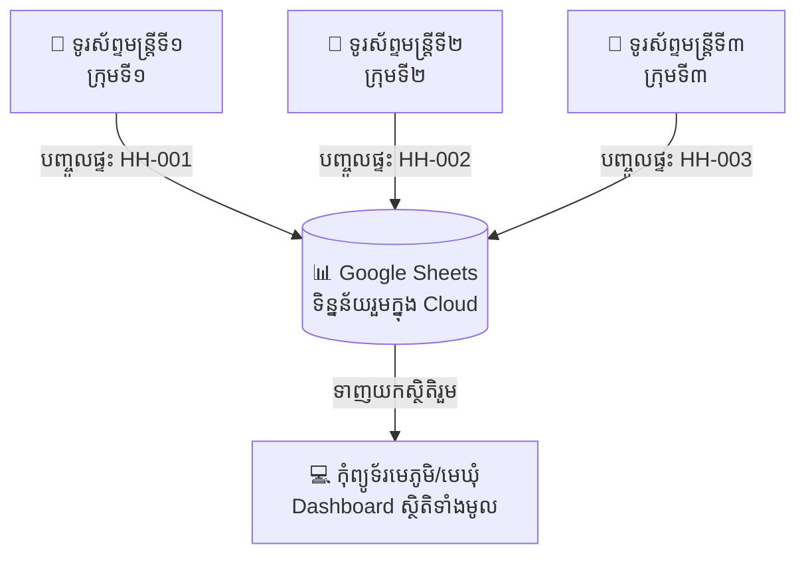

# ការណែនាំអំពីការប្រើប្រាស់ទូរស័ព្ទច្រើនដើម្បីបញ្ចូលទិន្នន័យរួមគ្នា (Multi-Phone Cloud Database)

ប្រព័ន្ធនេះត្រូវបានរចនាឡើងដើម្បីឱ្យ **មន្ត្រី ឬក្រុមការងារជាច្រើននាក់ អាចប្រើប្រាស់ទូរស័ព្ទរៀងៗខ្លួនចុះស្រង់ទិន្នន័យតាមខ្នងផ្ទះក្នុងភូមិ ហើយទិន្នន័យទាំងអស់នឹងរត់ចូលរួមគ្នាតែមួយក្នុង Google Sheets ដោយស្វ័យប្រវត្តិ (Real-time Cloud Sync)**។

---

## 🌟 របៀបដំណើរការលើទូរស័ព្ទច្រើន (Multi-Device Workflow)

---

## 🚀 ជំហានដំឡើងសម្រាប់ក្រុមការងារ (Setup Guide)

### ជំហានទី ១៖ មេភូមិ/រដ្ឋបាល បង្កើត Google Sheet & Deploy Web App (ធ្វើតែម្តងគត់)
1. បង្កើតឯកសារ [Google Sheets](https://sheets.new) ថ្មីមួយ ដាក់ឈ្មោះថា `ទិន្នន័យជំរឿនភូមិត្រពាំងថ្ម`
2. ចុច **Extensions** > **Apps Script**
3. ចម្លងកូដពីឯកសារ [`google-apps-script.js`](file:///C:/Users/Asus/.gemini/antigravity/scratch/village-census-system/google-apps-script.js) យកទៅបិទភ្ជាប់ (Paste) រួចចុច Save 💾
4. ចុច **Deploy** > **New deployment** > ជ្រើសរើស **Web app**
   - Execute as: **Me**
   - Who has access: **Anyone**
5. ចុច **Deploy** > **Authorize access** > ចម្លង **Web App URL** (ឧទាហរណ៍៖ `https://script.google.com/macros/s/AKfycb.../exec`)
6. ផ្ញើ **Web App URL** នេះ និង **Link គេហទំព័រ** (`https://romperb9-byte.github.io/village-census-system/`) ទៅកាន់ទូរស័ព្ទមន្ត្រីទាំងអស់។

---

### ជំហានទី ២៖ ការកំណត់លើទូរស័ព្ទរបស់មន្ត្រីម្នាក់ៗ
មន្ត្រីចុះស្រង់ទិន្នន័យតាមខ្នងផ្ទះ គ្រាន់តែធ្វើតាមជំហានងាយៗខាងក្រោមលើទូរស័ព្ទរបស់ខ្លួន៖

1. បើក Link គេហទំព័រលើ Browser ទូរស័ព្ទ៖
   👉 **[https://romperb9-byte.github.io/village-census-system/](https://romperb9-byte.github.io/village-census-system/)**
2. ចុចចូលម៉ឺនុយ **"ការកំណត់ព័ត៌មានភូមិ" (Settings)**៖
   - ត្រង់ **"ឈ្មោះមន្ត្រីស្រង់ទិន្នន័យ"**៖ បញ្ចូលឈ្មោះរបស់ខ្លួន (ឧ. `មន្ត្រី សុខា` ឬ `ក្រុមទី១`)
   - ត្រង់ **"Google Apps Script Web App URL"**៖ បិទភ្ជាប់ URL ដែលទទួលបានពីជំហានទី ១
3. ចុច **"រក្សាទុកការកំណត់"**។

---

## ✨ របៀបដែលទិន្នន័យត្រូវបានរក្សាទុករួមគ្នា

1. **បញ្ចូលគ្រួសារថ្មីលើទូរស័ព្ទ**៖
   - នៅពេលមន្ត្រីចុច **"រក្សាទុកទិន្នន័យ"** លើទូរស័ព្ទ នោះទិន្នន័យគ្រួសារ និងសមាជិក នឹងរុញចូល Google Sheets ភ្លាមៗ (Auto-saved to Cloud)។
2. **មើលទិន្នន័យដែលទូរស័ព្ទផ្សេងទៀតបានបញ្ចូល**៖
   - មន្ត្រីគ្រាន់តែចុចប៊ូតុង **"🔄 ទាញយកទិន្នន័យ"** នៅលើ Header នោះប្រព័ន្ធនឹងទាញយកទិន្នន័យថ្មីៗទាំងអស់ដែលមន្ត្រីផ្សេងទៀតបានបញ្ចូលមកបង្ហាញលើទូរស័ព្ទរបស់ខ្លួនភ្លាមៗ!
3. **សុវត្ថិភាពទិន្នន័យ & ដំណើរការពេលគ្មាន Internet (Offline Mode)**៖
   - ប្រសិនបើចុះទៅតំបន់ដាច់ស្រយាលដែលគ្មានសេវាទូរស័ព្ទ ប្រព័ន្ធនៅតែរក្សាទុកទិន្នន័យក្នុងទូរស័ព្ទបានធម្មតា ហើយនៅពេលមានអ៊ីនធឺណិតវិញ គ្រាន់តែចុច **"Sync Sheets"** នោះទិន្នន័យទាំងអស់នឹងរុញចូល Google Sheets ទាំងអស់ដោយស្វ័យប្រវត្តិ!
# ការកំណត់សុវត្ថិភាព Cloud Access Token (ត្រូវធ្វើ)

មុន Deploy Google Apps Script សូមចូល **Project Settings → Script Properties** ហើយបន្ថែម៖

- Property: `CLOUD_ACCESS_TOKEN`
- Value: សោសម្ងាត់វែងយ៉ាងតិច 32 តួអក្សរ ដែលពិបាកទាយ

បន្ទាប់ពី Deploy កូដថ្មី សូមបញ្ចូលតម្លៃដូចគ្នានេះក្នុងផ្ទាំង **ការកំណត់ → Cloud Access Token** របស់ប្រព័ន្ធ។ កុំផ្ញើ token តាមក្រុមសាធារណៈ និងកុំសរសេរវាចូលក្នុង source code។

> កំណែថ្មីនឹងបដិសេធការអាន ការបញ្ចូល ការកែប្រែ និងការលុប Cloud ប្រសិនបើមិនមាន token ត្រឹមត្រូវ។
